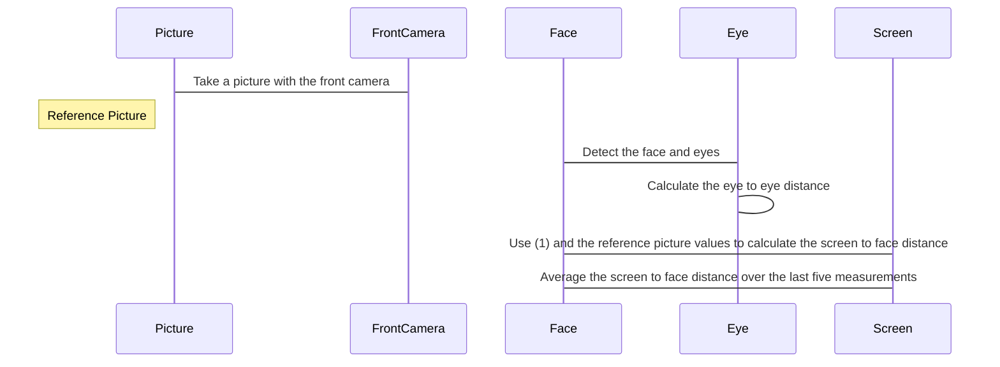

# Myey

> Our solution is for healthy eyesight by identifying its weaknesses
> earlier.
>
> The problem I see is that in my surroundings people are very hesitant
> to visit the doctor to get their eyes tested but they delay the
> process so much which will slowly weaken their eyes more and more.
>
> We are working on a solution to test the eyes of individuals to give
> an estimate of their visual power and testing their eyes on the app
> rewards them. So they can redeem those points in clinics and hospitals
> for discounts.

## Getting Started

To run the project on **IOS**

    flutter run ios

To run the project on **ANDROID**

    flutter run android

# Working Of Algorithm

StackEdit stores your files in your browser, which means all your files are automatically saved locally and are accessible **offline!**

## Formula

A reference is needed to derive a metric value for the screen to face distance: the eye to eye distance at a specific screen to face distance. We call this the reference picture and reference distance. By comparing the eye to eye distance of an actual camera picture with values from the reference picture, we can calculate the actual screen to face distance. We describe the relation between the eye to eye distance and the screen to face distance in respect to a reference by the following equation:

$$
{d_s}_f = {{p_r}_e}_f   /  {p_s}_f  *  {{d_r}_e}_f
$$

> Where:
>
> - ${d_s}_f =$ is the **screen to face** distance
> - ${p_s}_f  =$ is the **eye to eye** distance on the **actual picture**.
> - ${{d_r}_e}_f  =$ is the **screen to face** distance of the **reference picture**
> - ${{p_r}_e}_f =$ is the **eye to eye** distance on the **reference picture**.
>
> _We assume a linear relation between the screen to face distance and the eye to eye distance. The experiment outlined in Section IV and V reinforces our linearity assumption in a range from **19cm** to **89cm** screen to face distance._

## Explanation ( What to achieve )

#### Get an idea of steps to be followed:

1.  Take a picture with the front camera
2.  Detect the face and eyes
3.  Calculate the eye to eye distance
4.  Use (1) and the reference picture values to calculate the screen to face distance
5.  Average the screen to face distance over the last five measurements

# Reference

[GET RESEARCH PAPER HERE](https://github.com/UmarGit/MYEY/research_paper.pdf)
